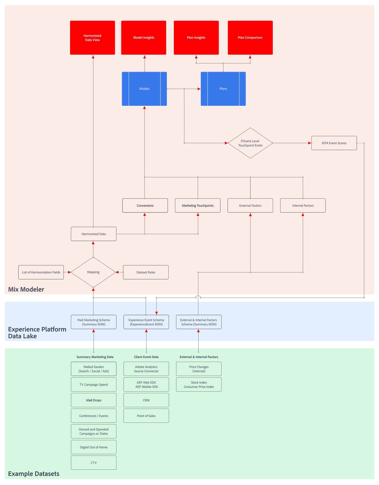

# Workflow Mix Modeler

Consultez cette vidéo pour une présentation du processus utilisateur en Mix Modeler.

>[!VIDEO](https://video.tv.adobe.com/v/3424854/?learn=on)

Un workflow type en Mix Modeler se compose des activités suivantes :

|  | Activité | Description |
|---|---|---|
| {width="100"} (Données) | [**Ingestion de données**](../ingest-data/overview.md) | Ingérer des données d’événement provenant d’un Experience Platform (par exemple Adobe Analytics, SDK Web, d’autres sources), des données agrégées provenant de canaux marketing (par exemple, télévision, jardins muraux, email, activités détenues et exploitées), des données de facteurs externes provenant des clients (par exemple, les changements de prix dans le service d’abonnement) et des données de facteurs internes (par exemple, les formules de vacances). |
| {width="100"} | [**Harmonisation des données**](../harmonize-data/overview.md) | Configurez les règles de mappage et les règles de résolution des conflits pour fusionner les différents jeux de données marketing nécessaires à la mesure et à la planification des performances des campagnes dans Mix Modeler. |
| {width="100"} | [**Configurer des modèles**](../models/create.md) | Configurez les instances de modèle avec les points de contact marketing (par exemple les canaux), les définitions de conversion et les facteurs internes et externes. |
| {width="100"} | [**Modèles de formation et de notation**](../models/overview.md) | Créez des scores agrégés et au niveau de l’événement à l’aide de la formation et de la notation de l’apprentissage automatique. |
| {width="100"} | [**Créer des plans**](../plans/overview.md) | Déterminez la meilleure allocation de fonds marketing pour atteindre un objectif commercial en utilisant les résultats des modèles de Mix Modeler. |
| {width="100"} | [**Tableau de bord Aperçu**](../dashboard/overview.md) | Obtenez des informations sur les données, les modèles et les plans harmonisés à l’aide de divers widgets configurables. |

{style="table-layout:auto"}

L’organigramme détaillé axé sur les données ci-dessous illustre comment :

* les données harmonisées reposent sur :

   * les données d’événement d’expérience (provenant du connecteur source Analytics, collectées via les SDK et les API Experience Platform, ingérées via les connecteurs source ou à l’aide de l’ingestion par flux),
   * données agrégées ou récapitulatives provenant de jardins clôturés (comme Facebook, YouTube), de sources de trafic ou de données publicitaires hors ligne, et
   * définitions des champs harmonisés et des règles de jeu de données.

* un modèle repose sur :

   * les définitions des points de contact de conversion et de marketing résultant des données harmonisées et
   * données agrégées ou récapitulatives non marketing contenant des facteurs internes ou externes.

* les scores d’événement d’attribution multi-touch peuvent éventuellement être réinjectés dans le lac de données Experience Platform pour être utilisés dans la configuration, la formation et la notation des modèles suivants.

