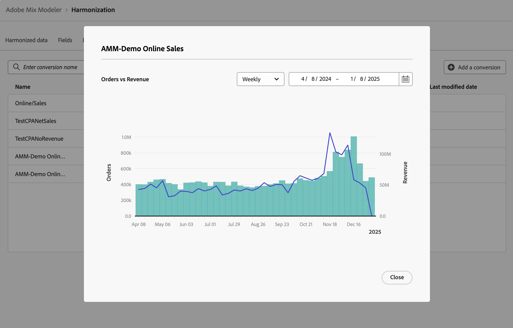

# de conversions

Les événements de conversion sont des objectifs commerciaux qui identifient l’impact des activités marketing. Exemples : commandes sur les plateformes d’e-commerce, achats en magasin, visites de sites web, etc.

Vous définissez des conversions marketing pour l’analyse d’attribution.

## Gestion des conversions

Pour afficher un tableau des conversions disponibles, dans l’interface du Mix Modeler :

1. Sélectionnez  **[!UICONTROL Harmonized data]** dans le rail de gauche.

1. Sélectionnez **[!UICONTROL Conversions]** dans la barre supérieure. Un tableau des conversions s’affiche.

Les colonnes du tableau indiquent les détails de la conversion :

| Nom de la colonne | Détails |
| --- | ---|
| Nom | Nom de la conversion. |
| Chiffre d’affaires | Mesure de données harmonisée à utiliser pour calculer le chiffre d’affaires d’une conversion. |
| Mesure de conversion | Mesure de données harmonisée à utiliser comme mesure de conversion pour l’analyse. |
| Catégorie | Catégorie de conversion de la conversion. |
| Créé | Date et heure de création de la conversion. |
| Dernière modification | Date et heure de la dernière modification de la conversion. |

## Ajouter une conversion

Pour ajouter une conversion, dans l’interface  **[!UICONTROL Harmonized data]** > **[!UICONTROL Conversion]** dans le Mix Modeler :

1. Sélectionnez  **[!UICONTROL Add a conversion]**.

1. Dans la boîte de dialogue **[!UICONTROL Create conversion]** :

   1. Saisissez un nom pour **[!UICONTROL Conversion]**, par exemple `Store Conversions`.

   1. Définissez la **[!UICONTROL Conversion category]**.

      1. Sélectionnez une valeur dans **[!UICONTROL *Sélectionner harmoniser...*]**, par exemple `Conversion types`.

      1. Sélectionnez une valeur pour l’opérateur , par exemple **[!UICONTROL is]**.

      1. Sélectionnez une valeur dans **[!UICONTROL *Sélectionner une valeur *]**ou saisissez une valeur, par exemple **[!UICONTROL Store]**.

   1. Sélectionnez un champ harmonisé dans **[!UICONTROL Conversion metric for analysis]**, par exemple **[!UICONTROL Orders]**.

   1. Sélectionnez un champ harmonisé dans **[!UICONTROL Revenue field]**, par exemple **[!UICONTROL Gross Demand]**.

   1. Pour créer la conversion, sélectionnez **[!UICONTROL Create]**. Pour annuler la création d’une conversion, sélectionnez **[!UICONTROL Cancel]**.

      

1. Une fois créée, la conversion est ajoutée au tableau des conversions.

## Afficher les détails

Pour afficher les détails d’une conversion :

1. Sélectionnez  lors du survol d’un nom de conversion dans le tableau.

1. Sélectionnez  **Afficher les détails**. Une boîte de dialogue affiche les détails de la conversion. Voir [Ajouter une conversion](#add-a-conversion) pour plus d’informations. Sélectionnez **[!UICONTROL Cancel]** pour fermer la boîte de dialogue.

## Afficher le rapport

Pour afficher le rapport d’une conversion :

1. Sélectionnez  lors du survol d’un nom de conversion dans le tableau.

1. Sélectionnez  **Afficher le rapport**. Une boîte de dialogue affiche un rapport de la conversion.

   

   * Pour modifier la granularité sur laquelle portera le rapport, sélectionnez une valeur dans le menu déroulant **[!UICONTROL Weekly]** .
   * Pour modifier la période sur laquelle portera l’état, saisissez une date de début et de fin ou utilisez  pour définir une période dans la fenêtre contextuelle du calendrier.

1. Sélectionnez **[!UICONTROL Close]** pour fermer la boîte de dialogue.

## Suppression d’une conversion

Pour supprimer une conversion :

1. Sélectionnez  **Supprimer** lorsque vous pointez sur un nom de conversion dans le tableau.
1. Dans la boîte de dialogue de confirmation de **[!UICONTROL Delete conversion]**, sélectionnez **[!UICONTROL Delete]** pour supprimer définitivement la conversion.
