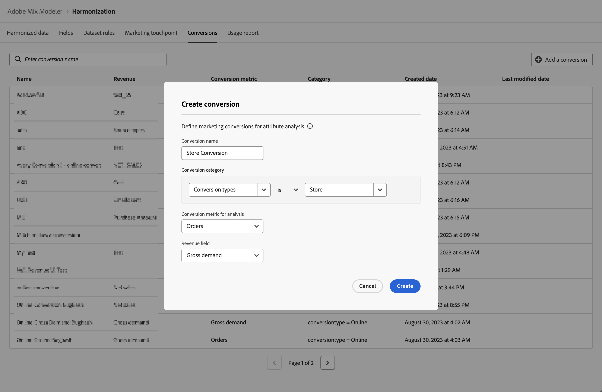

# de conversions

Les événements de conversion sont des objectifs commerciaux qui identifient l’impact des activités marketing. Exemples : commandes e-commerce, achats en magasin, visites sur le site web, etc.

Vous définissez des conversions marketing pour l’analyse d’attribution.

## Gestion des conversions

Pour afficher un tableau des conversions disponibles, dans l’interface du Mix Modeler :

1. Sélectionner  **[!UICONTROL Harmonized data]** dans le rail de gauche.

1. Sélectionner **[!UICONTROL Conversions]** dans la barre supérieure. Un tableau des conversions s’affiche.

Les colonnes du tableau spécifient les détails de la conversion :

| Nom de la colonne | Détails |
| --- | ---|
| Nom | Nom de la conversion. |
| Recettes | Mesure de données harmonisée à utiliser pour calculer les recettes d’une conversion. |
| Mesure de conversion | Mesure de données harmonisée à utiliser comme mesure de conversion à des fins d’analyse. |
| Créé | Date et heure de création de la conversion. |
| Dernière modification | Date et heure de la dernière modification de la conversion. |

{style="table-layout:auto"}

## Ajouter une conversion

Pour ajouter une conversion, dans la variable  **[!UICONTROL Harmonized data]** > **[!UICONTROL Conversion]** dans Mix Modeler :

1. Sélectionner  **[!UICONTROL Add a conversion]**.

1. Dans le **[!UICONTROL Create Conversion]** dialog :

   1. Saisissez un nom pour **[!UICONTROL Conversion]**, par exemple `Store Conversions`.

   1. Définissez la variable **[!UICONTROL Conversion category]**.

      1. Sélectionnez une valeur à partir de **[!UICONTROL *Sélectionnez Harmoniser...*]**, par exemple `Conversion Type`.

      1. Sélectionner une valeur pour l’opérateur , par exemple **[!UICONTROL is]**.

      1. Sélectionnez une valeur à partir de **[!UICONTROL *Sélectionner la valeur *]**ou saisissez une valeur, par exemple **[!UICONTROL Store]**.

   1. Sélectionnez un champ harmonisé depuis **[!UICONTROL Conversion metric for analysis]**, par exemple **[!UICONTROL Orders]**.

   1. Sélectionnez un champ harmonisé depuis **[!UICONTROL Revenue field]**, par exemple **[!UICONTROL Gross Demand]**.

   1. Pour créer la conversion, sélectionnez **[!UICONTROL Create]**. Pour annuler la création d’une conversion, sélectionnez **[!UICONTROL Cancel]**.

      

1. Une fois créée, la conversion est ajoutée au tableau des conversions.
