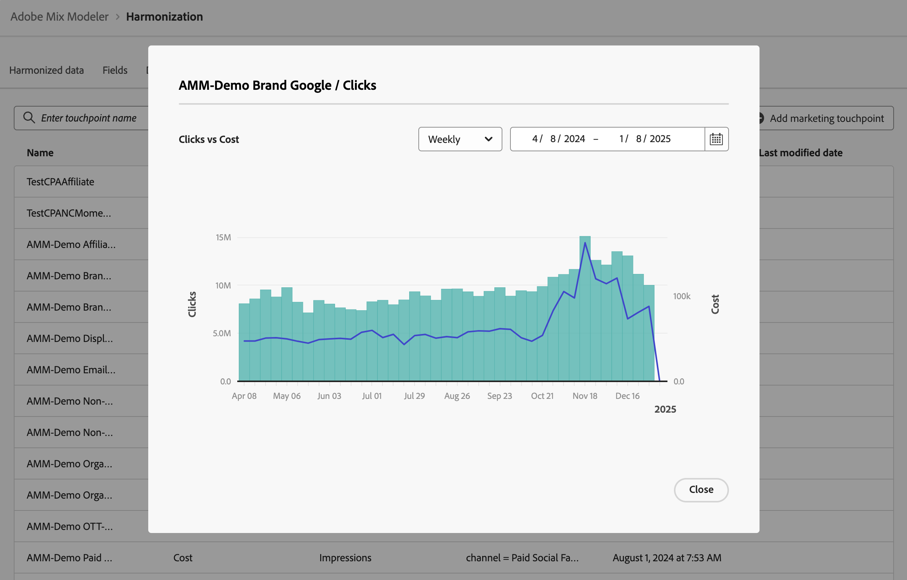

# Points de contact marketing {#marketing-touchpoints}

>[!CONTEXTUALHELP]
>id="harmonizeddata_marketingtouchpoints_create"
>title="Points de contact marketing"
>abstract="Les points de contact marketing sont des événements marketing au niveau de la personne destinataire, de l’individu ou du cookie utilisés pour évaluer l’impact des investissements marketing sur les conversions numériques ou basées sur les revenus."

Les points de contact marketing sont des événements marketing au niveau de la personne destinataire, de l’individu ou du cookie utilisés pour évaluer l’impact des investissements marketing sur les conversions numériques ou basées sur les revenus.

Vous définissez des points de contact marketing pour vous aider dans l’analyse d’attribution.

## Gestion des points de contact marketing

Pour afficher un tableau des points de contact marketing disponibles dans l’interface de Mix Modeler :

1. Sélectionnez  **[!UICONTROL Harmonized data]** dans le rail de gauche.

1. Sélectionnez **[!UICONTROL Marketing touchpoint]** dans la barre supérieure. Un tableau des points de contact marketing s’affiche. Si d’autres pages sont disponibles, utilisez  ou  à **[!UICONTROL Page _x _de_x_]** pour vous déplacer entre les pages du tableau.

Les colonnes du tableau indiquent des détails sur le point de contact marketing :

| Nom de la colonne | Détails |
| --- | ---|
| Nom | Nom du point de contact marketing. |
| Mesure des dépenses | Mesure de données harmonisée à utiliser pour calculer les dépenses liées aux points de contact. |
| Mesure du volume | Mesure de données harmonisée à utiliser pour calculer le volume des points de contact. |
| Composants de | Règle de point de contact à utiliser. |
| Créé | Date et heure de création du point de contact marketing. |
| Dernière modification | Date et heure de la dernière modification du contact marketing. |

## Ajouter un point de contact marketing

Pour ajouter un point de contact marketing, dans l’interface  **[!UICONTROL Harmonized data]** > **[!UICONTROL Marketing touchpoint]** de Mix Modeler :

1. Sélectionnez  Ajouter un point de contact marketing.

1. Dans la boîte de dialogue **[!UICONTROL Marketing touchpoint]**.

   1. Saisissez un nom pour **[!UICONTROL Touchpoint Name]**, par exemple `Luma Touchpoint`.

   1. Définissez une **[!UICONTROL Touchpoint rule]**.

      1. Sélectionnez une valeur dans **[!UICONTROL *Sélectionner harmonisé&#x200B;*]**, par exemple **[!UICONTROL Brand]**.

      1. Sélectionnez une valeur pour l’opérateur , par exemple **[!UICONTROL is]**.

      1. Sélectionnez une valeur dans **[!UICONTROL *Sélectionner une valeur *]**&#x200B;ou saisissez une valeur, par exemple **[!DNL Luma]**.

   1. Sélectionnez un champ harmonisé dans **[!UICONTROL Touchpoint volume]**, par exemple **[!UICONTROL Impressions]**.

   1. Sélectionnez un champ harmonisé dans **[!UICONTROL Touchpoint spend]**, par exemple **[!UICONTROL Cost]**.

      

   1. Pour créer le point de contact marketing, sélectionnez **[!UICONTROL Create]**. Pour annuler la création d’un point de contact marketing, sélectionnez **[!UICONTROL Cancel]** .

1. Une fois créé, le point de contact est ajouté au tableau des points de contact marketing.

## Afficher les détails

Pour afficher les détails d’un point de contact marketing :

1. Sélectionnez  lorsque vous passez la souris sur un nom de point de contact marketing dans le tableau.

1. Sélectionnez  **Affichage**. Une boîte de dialogue affiche les détails du point de contact marketing. Voir [&#x200B; Ajouter un point de contact marketing &#x200B;](#add-a-marketing-touchpoint) pour plus d’informations. Sélectionnez **[!UICONTROL Cancel]** pour fermer la boîte de dialogue.

## Afficher le rapport

Pour afficher un rapport d’un point de contact marketing :

1. Sélectionnez  lorsque vous passez la souris sur un nom de point de contact marketing dans le tableau.

1. Sélectionnez  **Afficher le rapport**. Une boîte de dialogue affiche un rapport du point de contact marketing.

   

   * Pour modifier la granularité sur laquelle portera le rapport, sélectionnez une valeur dans le menu déroulant **[!UICONTROL Weekly]** .
   * Pour modifier la période sur laquelle portera l’état, saisissez une date de début et de fin ou utilisez  pour définir une période dans la fenêtre contextuelle du calendrier.

1. Sélectionnez **[!UICONTROL Close]** pour fermer la boîte de dialogue.

## Supprimer un point de contact marketing

Pour supprimer un point de contact marketing :

1. Sélectionnez  **Supprimer** lorsque vous passez la souris sur un nom de point de contact marketing dans le tableau.
1. Dans la boîte de dialogue de confirmation de **[!UICONTROL Delete touchpoint]**, sélectionnez **[!UICONTROL Delete]** pour supprimer définitivement le point de contact marketing.

