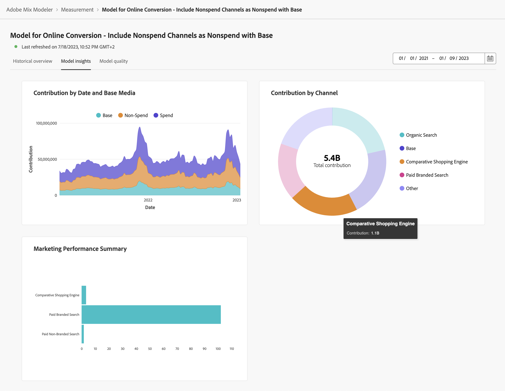

# Informations sur les modèles

Pour afficher les insights du modèle, dans la variable  **[!UICONTROL Models]** dans Mix Modeler :

1. Sélectionnez le nom d’un modèle avec une **[!UICONTROL Last run status]** de ● **[!UICONTROL Success]** de la **[!UICONTROL Models]** table.

1. Dans le menu contextuel, sélectionnez **[!UICONTROL Model Insights]**.

Le moment où le modèle spécifié est actualisé pour la dernière fois et les widgets s’affichent à l’aide de trois onglets : Aperçu historique, Informations sur le modèle et Qualité du modèle.

Vous pouvez modifier la période sur laquelle reposent les widgets sur chacun des onglets. Entrez une période ou sélectionnez  pour sélectionner une période.

## Présentation historique

L’onglet Aperçu historique affiche des widgets pour :

* Conversion et dépense par trimestre fiscal et par produit.

* Dépensé par canal.

* Point de contact - Dépense.

  Vous pouvez sélectionner un canal alternatif basé sur les dépenses à afficher pour ce widget. Sélection d’un canal depuis **[!UICONTROL Channels]**.

* Volume des points de contact.

  Vous pouvez sélectionner un autre canal en fonction du volume à afficher pour ce widget. Sélection d’un canal depuis **[!UICONTROL Channels]**.

## Informations sur les modèles

L’onglet Informations sur les modèles affiche des widgets pour :

* Contribution par date et support de base. Le graphique empilé est ordonné : d’après le bas, les canaux qui ne dépensent pas au milieu et les canaux qui dépensent au haut.

* Contribution par canal.

* Synthèse des performances marketing.

* Courbes de réponse marginales.

Vous pouvez placer le pointeur de la souris sur des éléments de graphique individuels dans chaque widget pour afficher une fenêtre contextuelle contenant plus de détails.

Pour télécharger un fichier CSV contenant les données du widget, sélectionnez .

Pour télécharger des données complètes sur les modèles au format Microsoft® Excel, sélectionnez  **[!UICONTROL Download data]**.

## Qualité du modèle

L’onglet Qualité du modèle affiche une

* [!UICONTROL Model Assessment] la visualisation, que vous pouvez ventiler en fonction des conversions réelles ou prévues ou résiduelles.

  Pour ventiler la visualisation, sélectionnez **[!UICONTROL Actual vs. Predicted]** ou **[!UICONTROL Residuals]** de la **[!UICONTROL Breakdown]** liste.

* [!UICONTROL Model fitting metrics] tableau affichant les colonnes suivantes pour chaque mesure de conversion :

   * Conversion réelle

   * Conversion modélisée

   * Conversion résiduelle (différence entre conversion réelle et conversion modélisée)

   * Valeurs de score de qualité du modèle :

      * R2 (au carré R), qui indique dans quelle mesure les données correspondent au modèle de régression (la qualité de l’ajustement).

      * MAPE (Erreur en pourcentage absolue moyenne), qui est l’un des IPC les plus couramment utilisés pour mesurer la précision des prévisions et exprime l’erreur de prévision en pourcentage de la valeur réelle.

      * RMSE (Root Mean Square Error) : qui affiche la moyenne de &quot;l’erreur&quot;, pondérée en fonction du carré de l’erreur.

  Pour télécharger un fichier CSV contenant les données du tableau, sélectionnez .
