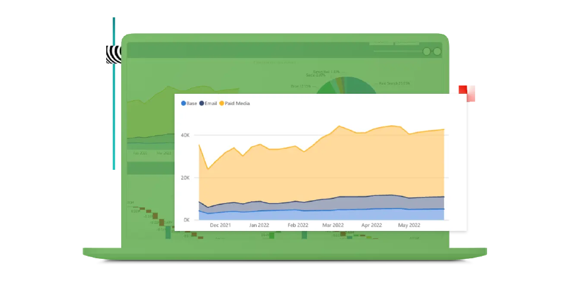

# Guide d’Adobe Mix Modeler

Ce guide de documentation technique fournit une aide autonome pour Adobe **Mix Modeler**. Mix Modeler est une application Adobe Experience Cloud qui mesure les campagnes et optimise la planification de manière holistique, sur tous les canaux : payant, gagné et détenu. Mix Modeler repose sur Adobe Experience Platform et est optimisé par Adobe Sensei.

## Commencer avec les principes de base

<table style="table-layout:fixed">
  <tr style="border: 0;">
    <td>
    
    
<strong>Démarrage rapide</strong> Obtenez une vue d’ensemble d’et d’insight dans le workflow de Mix Modeler.

    </td>
    <td>
    
    
<strong>Ingérer des données</strong> Découvrez comment ingérer des données d’événement et d’agrégation ou de synthèse dans Mix Modeler.

    </td>
    <td>
    
    
<strong>Harmoniser les données</strong> Découvrez comment assimiler des données agrégées et d’événement en une vue de données cohérente.. 
    

    </td>
    <td>
    
    
<strong>Modéliser et planifier</strong> Former et noter vos modèles et utiliser les informations pour vos plans marketing.

    </td>
  </tr>
  <tr style="border: 0;">
    <td align="center"></td>
    <td align="center"></td>
    <td align="center"></td>
    <td align="center"></td>
    </tr>
</table>

## Explorer la documentation

<table style="table-layout:fixed">
  <tr style="border: 0;">
    <td>
       
      <strong>Ingérer des données</strong> <a href="/help/ingest-data/overview.md">Aperçu</a> - <a href="/help/ingest-data/schemas.md">Schémas</a> - <a href="/help/ingest-data/datasets.md">Jeux de données</a> 
    </td>
    <td>
       
      <strong>Harmoniser les données</strong> <a href="/help/harmonize-data/overview.md">Aperçu</a> - <a href="/help/harmonize-data/fields.md">Champs</a> - <a href="/help/harmonize-data/dataset-rules.md">Règles du jeu de données</a> - <a href="/help/harmonize-data/marketing-touchpoints.md">Points de contact marketing</a> - <a href="/help/harmonize-data/conversions.md">Conversions</a> - <a href="/help/harmonize-data/usage-report.md">Rapport d’utilisation</a>  
    </td>
    <td>
       
      <strong>Modèles</strong> <a href="/help/models/overview.md">Aperçu</a> - <a href="/help/models/build.md">Créer des modèles</a> - <a href="/help/models/insights.md">Informations sur le modèle</a> - <a href="/help/models/scoring-data.md">Utiliser les données de notation</a>
    </td>
  </tr>
  <tr style="border: 0;">
    <td>
       
      <strong>Plans</strong> <a href="/help/plans/overview.md">Plans</a> - <a href="/help/plans/build.md">Créer des plans</a> - <a href="/help/plans/compare.md">Comparer des plans</a> - <a href="/help/plans/build.md">Informations sur les plans</a>
    </td>
    <td>
       
      <strong>Aperçu</strong> <a href="/help/dashboard/overview.md">Schémas</a> - <a href="/help/dashboard/harmonized-data.md">Données harmonisées</a> - <a href="/help/dashboard/plans.md">Plans</a>
    </td>
        <td>
       
      <strong>Tutoriels</strong> <a href="https://experienceleague.adobe.com/docs/mix-modeler-learn/tutorials/overview.html?lang=en">Aperçu</a> - <a href="https://experienceleague.adobe.com/docs/mix-modeler-learn/tutorials/intro/use-cases.html?lang=en">Cas d’utilisation</a> - <a href="https://experienceleague.adobe.com/docs/mix-modeler-learn/tutorials/intro/user-workflow.html?lang=en">Workflow utilisateur</a> - <a href="https://experienceleague.adobe.com/docs/mix-modeler-learn/tutorials/intro/user-interface-tour.html?lang=en">Visite guidée de l’interface utilisateur</a>
    </td>
  </tr>
</table>
