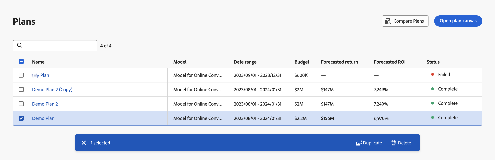

# Formules

Les plans en Mix Modeler vous permettent d’allouer des budgets par unité opérationnelle et canal. La fonctionnalité de planification est intégrée aux résultats des modèles formés en fonction de vos données harmonisées.

## Afficher les plans

Pour afficher un tableau de vos plans actuels, dans l’interface du Mix Modeler :

1. Sélectionner  **[!UICONTROL Plans]** dans le rail de gauche.

1. Vous voyez un tableau des plans actuels et de leur état.

   Les colonnes du tableau spécifient les détails des plans.

   | Nom de la colonne | Détails |
   |---|---|
   | Nom | Nom du plan |
   | Description | Description du modèle |
   | Modèle | Le modèle utilisé comme base du plan. |
   | Date range (Plage de dates) | La période complète d’un plan. |
   | Budget | Le budget total d’un plan. |
   | Retour prévisionnel | Le retour prévu d’un plan |
   | ROI prévisionnel | Le retour sur investissement prévu pour un plan. |
   | Statut | État d’un plan. |

   {style="table-layout:auto"}

1. Utilisation  pour rechercher et filtrer le tableau en fonction d’un ou de plusieurs plans spécifiques.

## Sélection et action sur les plans

Vous pouvez sélectionner un ou plusieurs plans, qui affichent la barre d’actions Plans . La barre d’actions permet de supprimer, comparer ou dupliquer des plans.

Pour supprimer toutes les sélections du tableau Plans, sélectionnez  dans la barre d’actions

### Dupliquer un plan

Pour dupliquer un plan :

1. Sélectionnez un plan unique dans le tableau.
1. Sélectionner  **[!UICONTROL Duplicate]** dans la barre d’actions. Un nouveau plan, dont le nom est composé du nom du plan d’origine est complété par **[!UICONTROL (Copy)]**, est ajouté en haut du tableau.

### Comparaison de plans

Pour comparer des plans :

1. Sélectionnez deux plans dans le tableau.
1. Sélectionner  **[!UICONTROL Compare]** dans la barre d’actions. Vous voyez le **[!UICONTROL Compare plans]** Interface utilisateur.

### Suppression de plans

Pour supprimer des plans :

1. Sélectionnez un ou plusieurs plans dans le tableau.
1. Sélectionner  **[!UICONTROL Delete]** dans la barre d’actions. Votre plan est immédiatement supprimé.

