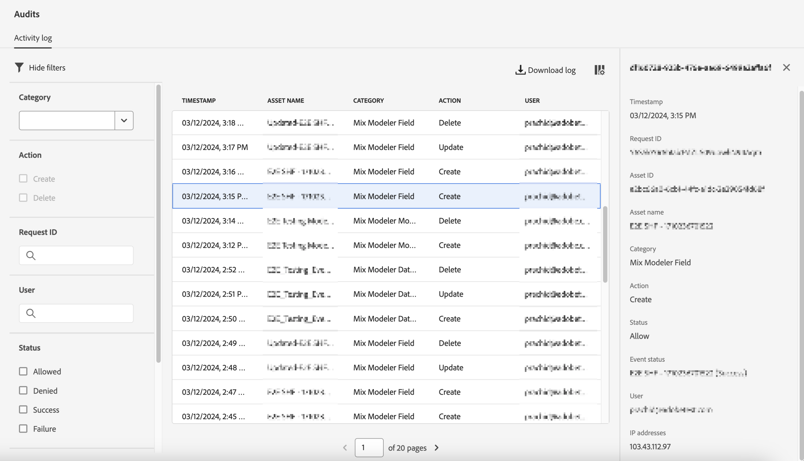

# Audit

>[!AVAILABILITY]
>
>Les fonctionnalités décrites dans cet article se trouvent dans la phase de test limité de la version et peuvent ne pas être encore disponibles dans votre environnement. Cette note sera supprimée lorsque la fonctionnalité sera disponible. Pour plus d’informations sur les dernières versions de Mix Modeler, voir [Versions Mix Modeler](/help/releases/latest.md).

Vous pouvez contrôler ce que les utilisateurs font dans Mix Modeler à l’aide de la partie Interface d’audit de l’Experience Platform et de l’interface utilisateur de Mix Modeler.

Pour examiner le journal d’audit, dans l’interface du Mix Modeler :

1. Sélectionner  **[!UICONTROL Audits]** de **[!UICONTROL PRIVACY]**.

1. Dans **[!UICONTROL Audits]** vous pouvez trouver la variable **[!UICONTROL Activity log]**. Le journal des activités affiche les entrées pour les catégories de Mix Modeler, les actions et l’état suivants.

   | Catégorie | Action | Statut |
   |---|---|---|
   | Règle de jeu de données Mix Modeler | Créer | Autoriser ou refuser |
   | Règle de jeu de données Mix Modeler | Mise à jour  | Autoriser ou refuser |
   | Règle de jeu de données Mix Modeler | Supprimer | Autoriser ou refuser |
   | Champ Mix Modeler | Créer | Autoriser ou refuser |
   | Champ Mix Modeler | Mise à jour  | Autoriser ou refuser |
   | Champ Mix Modeler | Supprimer | Autoriser ou refuser |
   | Point de contact marketing Mix Modeler | Créer | Autoriser ou refuser |
   | Point de contact marketing Mix Modeler | Mise à jour  | Autoriser ou refuser |
   | Point de contact marketing Mix Modeler | Supprimer | Autoriser ou refuser |
   | Conversion de Mix Modeler | Créer | Autoriser ou refuser |
   | Conversion de Mix Modeler | Mise à jour  | Autoriser ou refuser |
   | Conversion de Mix Modeler | Supprimer | Autoriser ou refuser |
   | Modèle Mix Modeler | Créer | Autoriser ou refuser |
   | Modèle Mix Modeler | Mise à jour  | Autoriser ou refuser |
   | Modèle Mix Modeler | Supprimer | Autoriser ou refuser |

1. Pour plus d’informations, sélectionnez une entrée dans le journal des activités afin d’ouvrir un panneau.

   

1. Pour filtrer sur **[!UICONTROL Category]**, **[!UICONTROL Action]**, **[!UICONTROL Request ID]**, **[!UICONTROL User]**, **[!UICONTROL Status]** ou **[!UICONTROL Date]** plage, sélectionnez .

1. Pour modifier les colonnes affichées dans le journal des activités, sélectionnez  et dans le **[!UICONTROL Customize table]** sélectionnez les colonnes à afficher. Sélectionner **[!UICONTROL Apply]** pour appliquer la sélection, **[!UICONTROL Cancel]** pour annuler la sélection.

1. Pour télécharger le journal d’audit, sélectionnez  **[!UICONTROL Download log]**. Dans le **[!UICONTROL Download log]** dialog select **[!UICONTROL CSV]** ou **[!UICONTROL JSON]** comme format et sélectionnez **[!UICONTROL Download]**.
